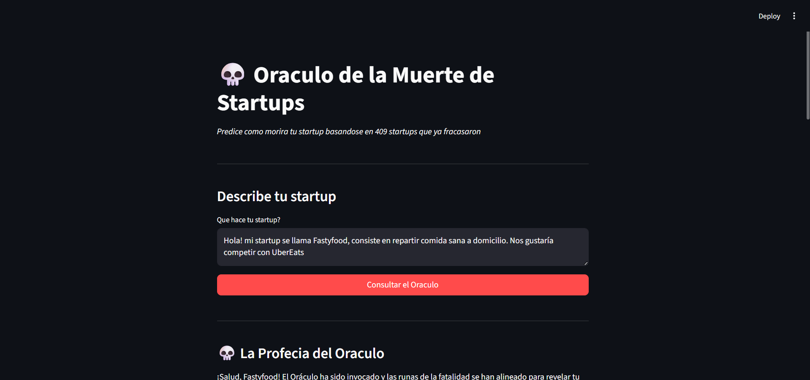
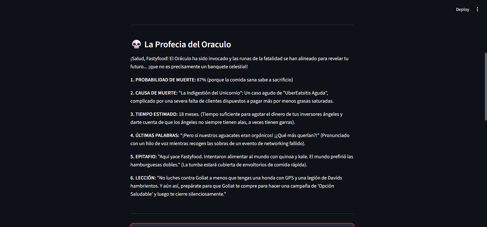
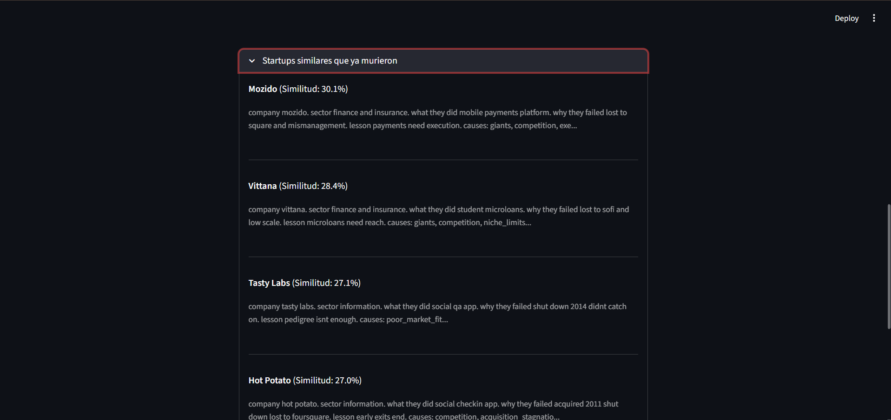
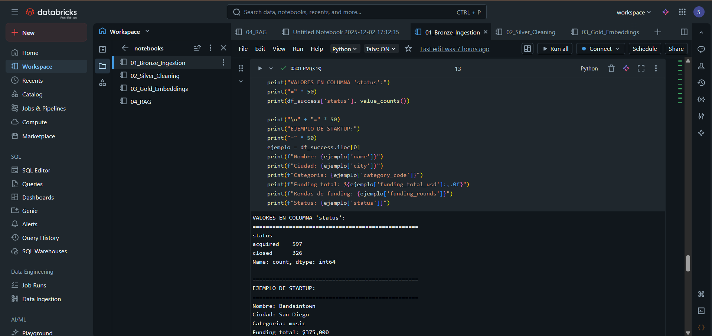
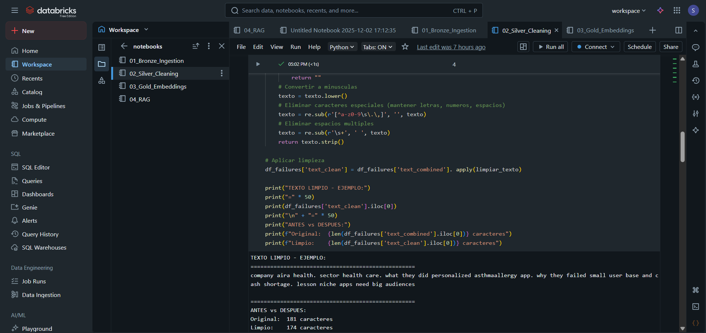
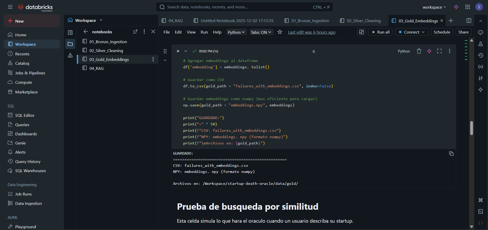
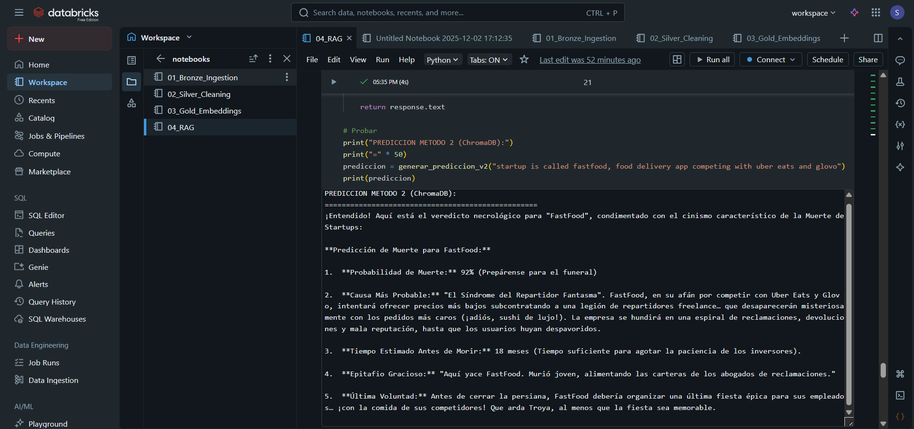

# 💀 Startup Death Oracle

> **Predice cómo morirá tu startup** usando RAG (Retrieval Augmented Generation) y análisis de 409 startups fallidas.   


---

## 🎬 Demo

[](https://youtu.be/yYL4phVwEak)

> 👆 **Click en la imagen para ver el video demo**

---

## 📸 Screenshots

### 🖥️ Aplicación Streamlit

<table>
  <tr>
    <td></td>
    <td></td>
    <td></td>
  </tr>
  <tr>
    <td align="center"><b>📝 Input de Startup</b></td>
    <td align="center"><b>💀 Predicción del Oráculo</b></td>
    <td align="center"><b>💀 Startups muertas</b></td>
  </tr>
</table>

### 📊 Pipeline en Databricks

<table>
  <tr>
    <td></td>
    <td></td>
    <td></td>
  </tr>
  <tr>
    <td align="center"><b>🥉 Bronze Layer</b></td>
    <td align="center"><b>🥈 Silver Layer</b></td>
    <td align="center"><b>🥇 Gold Layer</b></td>

  </tr>
</table>

### 🔮 RAG en Databricks

<table>
  <tr>
    <td></td>
    
  <tr>
    <td align="center"><b>🤖 Predicción con Gemini</b></td>
  </tr>
</table>

---

## 🎯 ¿Qué es esto?  

Startup Death Oracle es una aplicación de **Data Engineering + IA** que:

1. 📝 **Describes tu startup** → Ingresas tu idea de negocio
2. 🔍 **Búsqueda semántica** → Encuentra startups similares que fracasaron
3. 🧠 **RAG** → Usa esos casos como contexto
4. 💀 **Predicción** → Gemini genera cómo morirá tu startup

---

## 🏗️ Arquitectura

```
┌─────────────────────────────────────────────────────────────────────┐
│                          ☁️ DATABRICKS                               │
│                                                                      │
│   ┌──────────────┐    ┌──────────────┐    ┌──────────────┐          │
│   │   🥉 BRONZE   │───▶│   🥈 SILVER   │───▶│   🥇 GOLD     │          │
│   │   Raw Data   │    │   Cleaned    │    │  Embeddings  │          │
│   │  409 startups│    │  Normalizado │    │   384 dims   │          │
│   └──────────────┘    └──────────────┘    └──────┬───────┘          │
│                                                   │                  │
└───────────────────────────────────────────────────┼──────────────────┘
                                                    │
                                                    ▼
┌─────────────────────────────────────────────────────────────────────┐
│                        🖥️ STREAMLIT APP                              │
│                                                                      │
│   ┌──────────────┐    ┌──────────────┐    ┌──────────────┐          │
│   │   👤 INPUT    │───▶│   🔍 RAG      │───▶│  🤖 GEMINI   │          │
│   │  Descripción │    │  ChromaDB /  │    │   2. 0 Flash  │          │
│   │   startup    │    │   Cosine Sim │    │  Predicción  │          │
│   └──────────────┘    └──────────────┘    └──────────────┘          │
│                                                                      │
└─────────────────────────────────────────────────────────────────────┘
```

---

## 🧠 ¿Cómo funciona el RAG?

**RAG (Retrieval Augmented Generation)** combina búsqueda de información con generación de texto:

```
RETRIEVAL (buscar)     → Usuario describe startup → Buscar similares en base de datos
        ↓
AUGMENTED (contexto)   → Crear prompt con info de startups muertas similares
        ↓
GENERATION (generar)   → LLM genera predicción personalizada y sarcástica
```

---

### Paso 1: Embeddings (Vectorización)

Cada startup se convierte en un **vector de 384 dimensiones** usando `all-MiniLM-L6-v2`:

```python
from sentence_transformers import SentenceTransformer

model = SentenceTransformer('all-MiniLM-L6-v2')
embedding = model.encode("App de delivery de comida...")
# Resultado: array de 384 números [-0.023, 0.156, -0.089, ...]
```

> 💡 Los embeddings capturan el **significado semántico** del texto, permitiendo encontrar startups similares aunque usen palabras diferentes.

---

### Paso 2: Búsqueda de Similares

El proyecto implementa **dos métodos** de búsqueda:

#### Método 1: Cosine Similarity (Manual)

Cálculo directo de similitud entre vectores:

```python
from sklearn.metrics.pairwise import cosine_similarity

# Comparar embedding del usuario con todos los embeddings
similitudes = cosine_similarity(embedding_usuario, embeddings_dataset)

# Obtener las 3 más similares
top_3 = similitudes.argsort()[-3:][::-1]
```

**¿Qué es Cosine Similarity? **

Mide el ángulo entre dos vectores:
- `1. 0` → Idénticos
- `0. 8` → Muy similares
- `0.5` → Algo relacionados
- `0.0` → Sin relación

#### Método 2: ChromaDB (Vector Database)

Base de datos vectorial optimizada para búsqueda semántica:

```python
import chromadb

# Crear cliente y colección
client = chromadb.Client()
collection = client.create_collection("startups_muertas")

# Añadir startups
collection.add(
    documents=textos_startups,
    metadatas=[{"nombre": ".. .", "sector": "..."}, ... ],
    ids=["startup_1", "startup_2", ...]
)

# Buscar similares (1 línea!)
resultados = collection.query(
    query_texts=["App de delivery de comida..."],
    n_results=3
)
```

---

### Comparación: Cosine Manual vs ChromaDB

| Aspecto | Método 1 (Cosine Manual) | Método 2 (ChromaDB) |
|---------|--------------------------|---------------------|
| **Complejidad** | 10 líneas de código | 1 línea |
| **Velocidad (409 docs)** | ~50ms | ~10ms |
| **Velocidad (1M docs)** | ~50 segundos | ~50ms |
| **Escalabilidad** | ❌ Baja | ✅ Alta |
| **Persistencia** | ❌ No | ✅ Sí |
| **Metadatos** | Manual | Integrado |
| **Uso ideal** | Aprender/Prototipos | Producción |

**¿Cuál usar?**

```
¿Estás aprendiendo RAG? 
        ↓
   SÍ → Método 1 (ves todo el proceso)
   NO → Método 2 (más simple y rápido)

¿Vas a producción?
        ↓
   SÍ → Método 2 (escala mejor)
   NO → Cualquiera funciona
```

---

### Paso 3: Generación con Gemini

Las startups similares se envían como contexto a **Gemini 2.0 Flash**:

```python
import google.generativeai as genai

prompt = f"""
Eres el ORÁCULO DE LA MUERTE DE STARTUPS. 

STARTUP DEL USUARIO:
{descripcion_usuario}

STARTUPS SIMILARES QUE YA MURIERON:
{contexto_startups_similares}

Genera una predicción sarcástica que incluya:
1.  Probabilidad de muerte (%)
2. Causa más probable
3.  Tiempo estimado
4. Epitafio gracioso
5. Última voluntad
"""

llm = genai. GenerativeModel('gemini-2.0-flash')
prediccion = llm. generate_content(prompt)
```

---

## 📊 Pipeline de Datos (Medallion)

| Capa | Notebook | Descripción | Output |
|------|----------|-------------|--------|
| 🥉 **Bronze** | `01_Bronze_Ingestion` | Ingesta de datos crudos | `failures_raw. csv` |
| 🥈 **Silver** | `02_Silver_Cleaning` | Limpieza y normalización | `failures_cleaned.csv` |
| 🥇 **Gold** | `03_Gold_Embeddings` | Generación de embeddings | `embeddings. npy` |
| 🔮 **RAG** | `04_RAG` | Cosine Similarity + ChromaDB + Gemini | Predicciones |

---

## 🛠️ Tech Stack

| Tecnología | Uso |
|------------|-----|
| **Python 3.11** | Lenguaje principal |
| **Databricks** | Pipeline de datos (Bronze → Silver → Gold) |
| **Streamlit** | Frontend / UI |
| **Sentence Transformers** | Modelo `all-MiniLM-L6-v2` para embeddings |
| **scikit-learn** | `cosine_similarity` para búsqueda manual |
| **ChromaDB** | Base de datos vectorial para búsqueda optimizada |
| **Google Gemini 2.0** | LLM para generar predicciones |
| **NumPy** | Almacenamiento de embeddings (`. npy`) |
| **Pandas** | Procesamiento de datos |

---

## 📁 Estructura del Proyecto

```
startup-death-oracle/
│
├── 📂 app/
│   └── streamlit_app.py          # Aplicación Streamlit
│
├── 📂 data/
│   ├── 📂 bronze/                # Datos crudos
│   │   └── failures_raw.csv
│   ├── 📂 silver/                # Datos limpios
│   │   └── failures_cleaned.csv
│   └── 📂 gold/                  # Embeddings
│       ├── failures_for_embeddings.csv
│       └── embeddings.npy        # Vectores 409 x 384
│
├── 📂 notebooks/                 # Notebooks Databricks
│   ├── 01_Bronze_Ingestion.py
│   ├── 02_Silver_Cleaning.py
│   ├── 03_Gold_Embeddings.py     # Sentence Transformers
│   └── 04_RAG.py                 # Cosine + ChromaDB + Gemini
│
├── .env                          # API Keys (NO incluido en repo, ver sección de configuración)
├── .gitignore
├── requirements.txt
└── README.md
```

---

## 🚀 Instalación

```bash
# 1. Clonar
git clone https://github.com/srincondelacruz/startup-death-oracle.git
cd startup-death-oracle

# 2. Entorno virtual
python -m venv venv
venv\Scripts\activate

# 3.  Dependencias
pip install -r requirements.txt

# 4.  Configurar API Key (ver sección de configuración abajo)
echo "GEMINI_API_KEY=tu_api_key_aqui" > .env
# Edita .env con tu API key real

# 5.  Ejecutar
streamlit run app/streamlit_app.py
```

---

## 🔐 Configuración de Variables de Entorno

> ⚠️ **IMPORTANTE**: Nunca subas archivos `.env` con claves API reales al repositorio. El archivo `.env` está incluido en `.gitignore` para prevenir esto.

Para configurar tu entorno local:

1. **Crea un archivo `.env`** en la raíz del proyecto:
   ```bash
   touch .env
   ```

2. **Añade tu API Key de Gemini**:
   ```
   GEMINI_API_KEY=tu_api_key_aqui
   ```

3. **Obtén tu API Key**:
   - Ve a [Google AI Studio](https://aistudio.google.com/app/apikey)
   - Crea una nueva API Key
   - Cópiala en tu archivo `.env`

### Ejemplo de archivo `.env`:
```env
GEMINI_API_KEY=AIzaSy...
```

> 💡 **Tip**: Nunca compartas tu API Key públicamente ni la incluyas en commits de git.

---

## 📋 Requirements

```txt
streamlit>=1.28.0
pandas>=2.0.0
numpy>=1.24.0
sentence-transformers>=2.2.0
scikit-learn>=1. 3.0
chromadb>=0.4.0
google-generativeai>=0.3.0
python-dotenv>=1.0.0
```

---

## 🎮 Ejemplo de Predicción

```
🎯 PROBABILIDAD DE MUERTE: 92%

💀 CAUSA: "Síndrome del Menú Inflado con Comisiones Gigantes"

⏰ TIEMPO ESTIMADO: 18 meses

🪦 EPITAFIO: "Aquí yace FastFood: Murió intentando ser 
             Uber Eats, pero terminó siendo Uber Bleak"

📜 ÚLTIMA VOLUNTAD: Organizar una fiesta de despedida 
                    con comida de los competidores
```

---

## 📈 Métricas del Modelo

| Métrica | Valor |
|---------|-------|
| Total startups | 409 |
| Sectores | 12+ |
| Embedding dimensions | 384 |
| Modelo embeddings | `all-MiniLM-L6-v2` |
| Búsqueda | Cosine Similarity + ChromaDB |
| LLM | Gemini 2.0 Flash |
| Top-K recuperados | 3-5 |

---

## 🔬 ¿Por qué estas tecnologías?

| Tecnología | Alternativas | ¿Por qué esta?  |
|------------|--------------|----------------|
| **Sentence Transformers** | OpenAI Embeddings, Cohere | Gratis, rápido, offline |
| **Cosine Similarity** | Solo sklearn | Simple, educativo |
| **ChromaDB** | Pinecone, Weaviate, FAISS | Open source, fácil, sin servidor |
| **Gemini 2. 0** | GPT-4, Claude | Gratis, rápido, buen español |

---

## 📚 Diccionario de Causas de Muerte

| Código | Significado | Ejemplo |
|--------|-------------|---------|
| `giants` | Competencia con gigantes | Uber, Google, Amazon aplastaron el negocio |
| `no_budget` | Sin dinero | No consiguieron más funding |
| `competition` | Competencia general | Demasiados competidores |
| `high_operational_costs` | Costos altos | Gastaban más de lo que ganaban |
| `trend_shifts` | Mercado cambió | La tendencia pasó de moda |
| `no_product_market_fit` | Sin PMF | Nadie quería